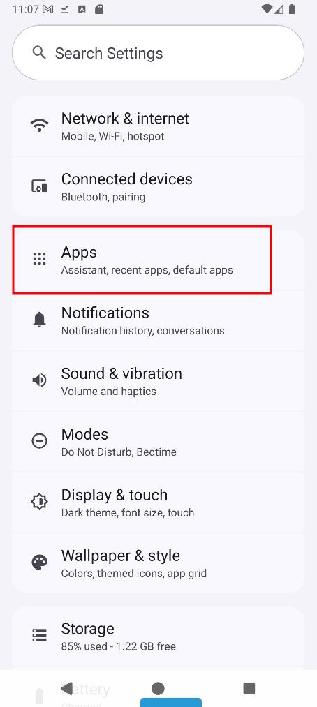
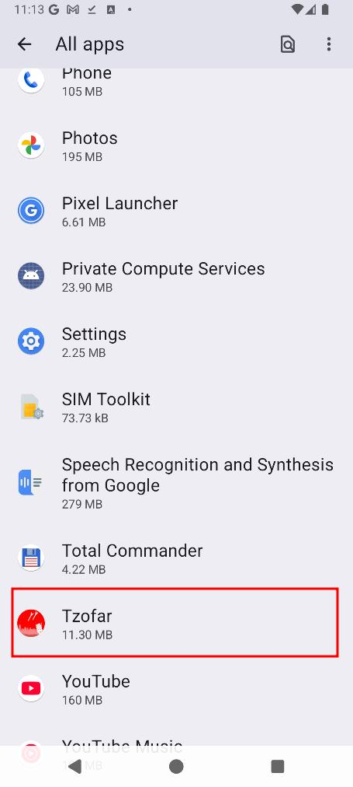
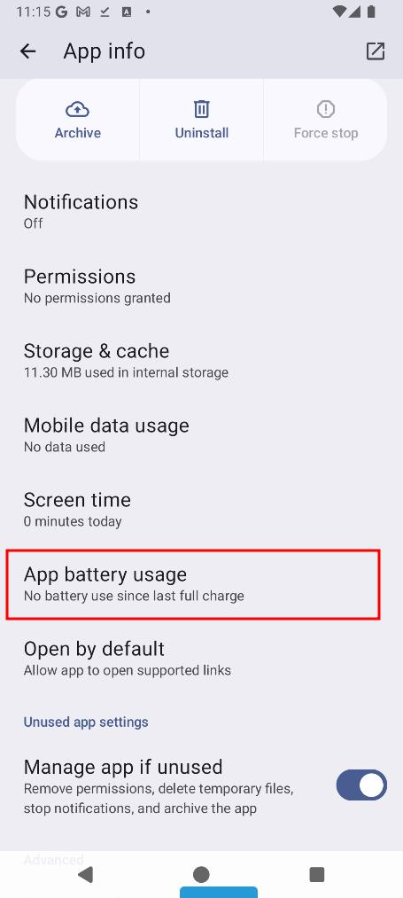
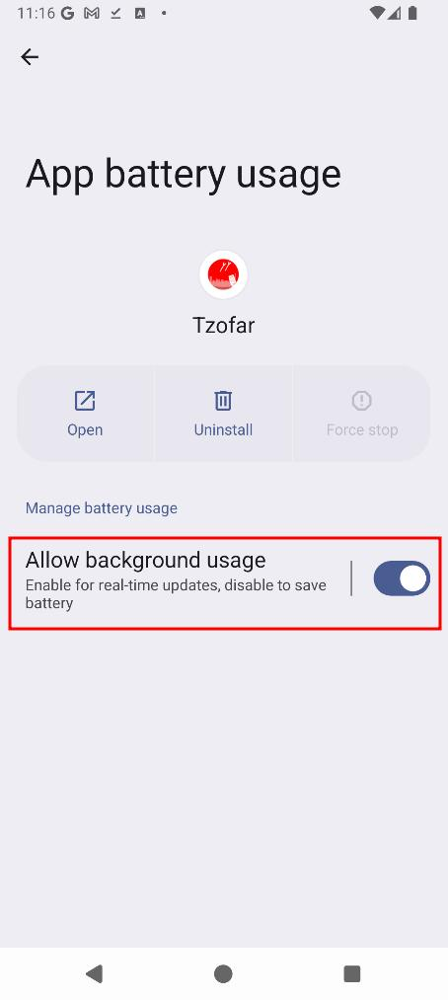
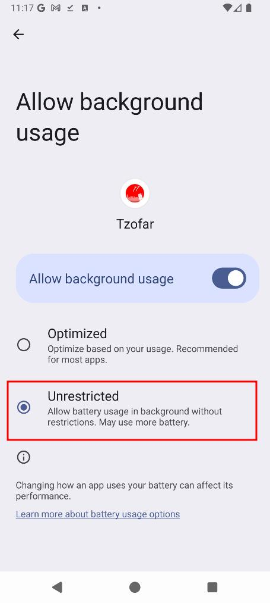

## שיפור התגובתיות של אפליקצית התראות פיקוד העורף בטלפון אנדרואיד
בטלפונים שמריצים אנדרואיד (כל הטלפונים חוץ מ iPhone) קיים מנגנון לחסכון בסוללה שלא מאפשר **לאפליקציות "סגורות"** לרוץ מתי שבא להן ברקע. אפליקציה "סגורה" תוכל לרוץ ברקע בסופו של דבר,  אבל לא תמיד מייד כשהיא תרצה. אפליקציה נחשבת "סגורה" בכל זמן שאנחנו משתמשים באפליקציה אחרת, או כשמסך הטלפון סגור. כתוצאה מכך יתכן מצב בו מתקבלת התראה מפיקוד העורף, אבל מערכת האנדרואיד לא מאפשרת לאפליקציה להתריע מייד, ונוצר עיכוב בקבלת ההתרעה.

כדי למנוע מצב כזה ניתן לקנפג את הטלפון כך שאנחנו מסמנים לאנדרואיד שהתגובתיות המיידית של אפליקציה מסויימת חשובה לנו, אז נא לא לעכב אותה. כאן יש הסבר איך לבצע את הקינפוג הזה. מאחר ומכשירי אנדרואיד שונים נראים קצת אחרת, יתכן והמסכים אצלכם לא יראו בדיוק אותו הדבר, אבל בכל מקרה הקינפוג מתבצע בדרך דומה.
1. פתח את ה-"settings" או "הגדרות", ולחץ על "Apps" או "אפליקציות":

 

 
 
 

2. מצא את אפליקצית ההתראות שלך. בדוגמה כאן אני משתמש באפליקצית "צופר" (שאגב, לדעתי היא מצויינת), ולחץ עליה:

 

 

3. לחץ על "App battery usage". בטלפונים של סמסונג זה נקרא פשוט "Battery":

 
 
 

4. וודא ש-"Allow background usage" דלוק (בטלפוני סמסונג אין את הכפתור, זה בסדר, המשך כרגיל), ולחץ על הטקסט:
  
 

 
 
 

5. בחר באופציה "Unrestricted". בטלפון סמסונג יש כאן שלוש אופציות, לא שתיים, אבל בכל מקרה בחר באופציה "Unrestricted" או "לא מוגבל":
  
 

 
 
 

זהו! עכשיו האנדרואיד יודע לא להגביל את ריצת אפליקצית ההתרעות בטלפון שלך. עדיין יתכנו פיספוסים של התרעות מסיבות אחרות, אבל בד"כ זה פותר את הבעיה.

